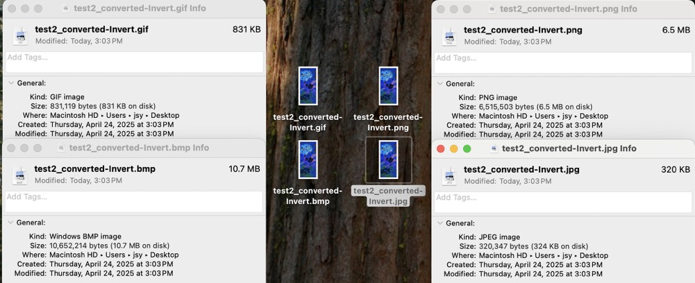

# INFO5100 Final Project Image Management Tool

A JavaFX-based desktop application for managing images. Users can upload images, preview thumbnails, convert between image formats (PNG, JPG, BMP, GIF), and apply image filters such as **black-and-white** and **inverted colors**.

---

## 📦 Features

- 📤 Upload local images
- 🖼️ Generate and preview image thumbnails
- 📑 View image metadata (filename, resolution, size, format, modified date)
- 🔄 Convert images to different formats: PNG, JPG, BMP, GIF
- 🎨 Apply filters:
  - Black & White
  - Invert colors
- 💾 Save converted images to computer

---

## 🎯 Technologies Used

- **JavaFX** for GUI (Java SDK 24.0.1)
- **Java AWT & Swing** for image processing
- **use of inheritance, encapsulation and interfaces**
  - **Inheritance**
    - Both the BlackWhiteFilter and InvertFilter classes inherit from the Filter interface and implement the apply(BufferedImage) method
    - ImageTool inherits from the Application class of JavaFX and is used for GUI startup
  - **Encapsulation**
    - Each class is responsible for a specific duty, such as:
      - Convert: Handle image format conversion and filter conversion;
      - ImageFiles: Provide image file information (such as BufferedImage original image, width and height, format, etc.);
      - Download and Upload: Download and Upload files;
      - InvertFilter: Invert images;
      - BlackWhiteFilter: Convert images to Black-White format.
  - **Interfaces**
    - Filter is a custom interface that defines a image processing method
    - BlackWhiteFilter and InvertFilter implement this interface, allowing for flexible use in FilterFactory
- **Design Patterns**:
  - `Filter` Interface (Strategy Pattern)
  - `FilterFactory` (Factory Method Pattern)

---

## 🗂️ Project Structure(Class Diagram)

## 🚀 How to Run

You can run this project easily using IntelliJ IDEA or any Java IDE that supports JavaFX:

### ✅ Prerequisites

- **Java JDK 17** or later installed  
- **JavaFX SDK 17** or later downloaded and extracted  
- **IntelliJ IDEA** (recommended) or another IDE

---

### 💡 Run the App

#### 1. Download the Project

Download the ZIP and extract it.

#### 2. Open the Project in IntelliJ or other IDE
- IntelliJ IDEA For Example

  - **Option A**: Launch **IntelliJ IDEA**, click `Open`, and select the folder containing the project.
  - **Option B**: Simply **drag and drop** the entire project folder into the IntelliJ IDEA window.
  - - **Other IDEs**: Use the IDE’s method to run a Java project and import JavaFX.

#### 3. Configure JavaFX

Go to `File` → `Project Structure` → `Libraries`

- Click the ➕ icon → Choose **Java**
- Select the `lib` folder inside your downloaded JavaFX SDK (e.g., `javafx-sdk-24.0.1/lib`)
- Apply and close.

#### 4. Set VM Options for JavaFX

Go to `Run` → `Edit Configurations`

In the **VM options** field, paste the following (update the path as needed):

--module-path "Your actual path/javafx-sdk-24.0.1/lib" --add-modules javafx.controls,javafx.fxml,javafx.swing

#### 5. Run the App

## 🖼️ Screenshots

Here are some screenshots showcasing the main features of the Image Management Tool:

### Main Interface  
Displays the main UI layout with upload, thumbnail, conversion, and download sections.  

### Thumbnail and Properties Display
Displays uploaded image thumbnails in a scrollable panel and when you clicking a thumbnail, it will shows detailed image information such as size, format, and color type

When you click the thumbnail twice, it will show the full image.

### Format Conversion  
You can select desired formats and click "Convert" to transform the image type.  
  

### Black & White Filter  
You can convert image into grayscale using a black-and-white filter. But there may be something wrong about .bmp file review.
  

### Invert Filter  
You can convert image into a color-negative image using a invert filter. But there may be something wrong about .bmp file review.
  

### Download Converted Files  
Converted results will be listed with download buttons.  

