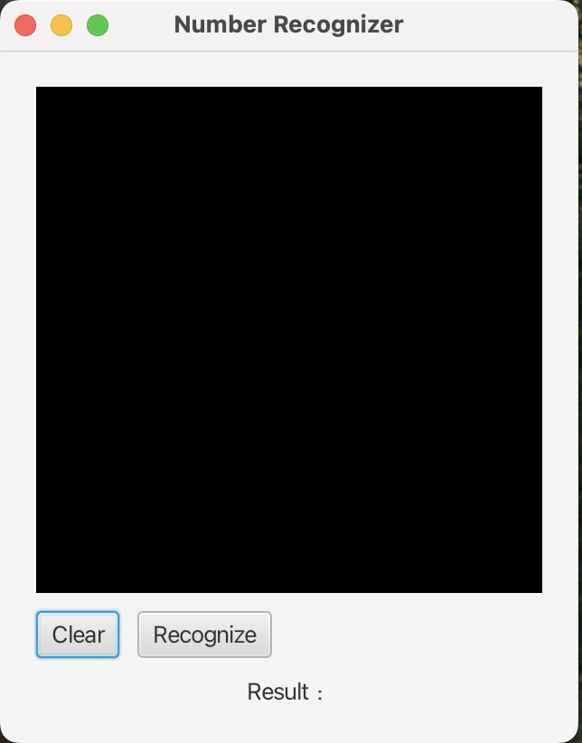
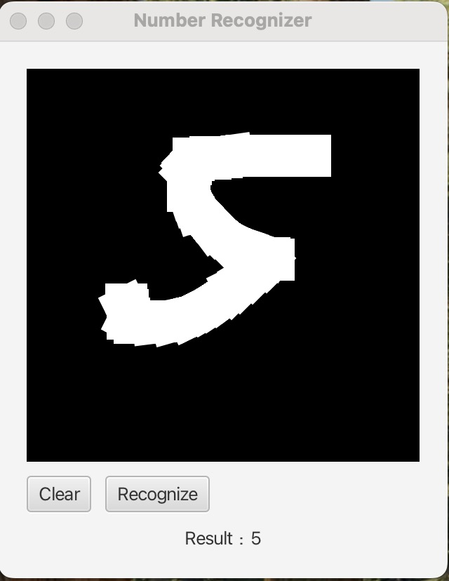

# INFO5100 Final Project Number Recognizer

A JavaFX-based desktop application for recognizing numbers. 
Users can **draw digits on a canvas** and **recognize the handwritten digit**.

---------------------------------------------------------------------------------------------------------------------------------------------------

## Features

- Draw digits on a canvas
- Save the drawing
- Show result

---------------------------------------------------------------------------------------------------------------------------------------------------

## Technologies Used

- **JavaFX for GUI (Java SDK 24.0.1)**
- **Python for machine learning model and predict**
- **TensorFlow**

---------------------------------------------------------------------------------------------------------------------------------------------------

## How to Run

You can run this project easily using IntelliJ IDEA or any Java IDE that supports JavaFX:

### Prerequisites

- **Java JDK 17** or later installed  
- **JavaFX SDK 17** or later installed
  You can download JavaFX from there: [Download JavaFX](https://openjfx.io/index.html)
- **Python 3** installed
- **IntelliJ IDEA** or another IDE

---------------------------------------------------------------------------------------------------------------------------------------------------

### Run the App

#### 1. Download the Project

Download the ZIP and extract it.

#### 2. Open the Project in IntelliJ or other IDE
- IntelliJ IDEA For Example

  - **Option A**: Launch **IntelliJ IDEA**, click `Open`, and select the folder containing the project.
  - **Option B**: Simply **drag and drop** the entire project folder into the IntelliJ IDEA window.
  - - **Other IDEs**: Use the IDE’s method to run a Java project and import JavaFX.

#### 3. Configure JavaFX

Go to `File` → `Project Structure` → `Libraries`

- Click the ➕ icon → Choose **Java**
- Select the `lib` folder inside your downloaded JavaFX SDK (e.g., `javafx-sdk-24.0.1/lib`)
- Apply and close.

#### 4. Set VM Options for JavaFX

Go to `Run` → `Edit Configurations`

In the **VM options** field, paste the following (update the path as needed):

--module-path "Your actual path/javafx-sdk-24.0.1/lib" --add-modules javafx.controls,javafx.fxml,javafx.swing

#### 5. Run the App

---------------------------------------------------------------------------------------------------------------------------------------------------

## Screenshots

Here are some screenshots showcasing the main features of the Number Recognizer:

### Main UI    

### Recognize
You can draw digits on the canvas and recognize the handwritten digit.

---------------------------------------------------------------------------------------------------------------------------------------------------

## Error Occur

### ⚠️ Error: Model file not found or predict file not found

#### Cause
The Python could not locate the trained model file (`digit_model.keras`).
The Java could not locate the predict.py file.

#### Solution
- Make sure `digit_model.keras` exists in the same folder as `predict.py`, or provide the correct path to the file.
- Or ensure the IDE working directory is correctly set
